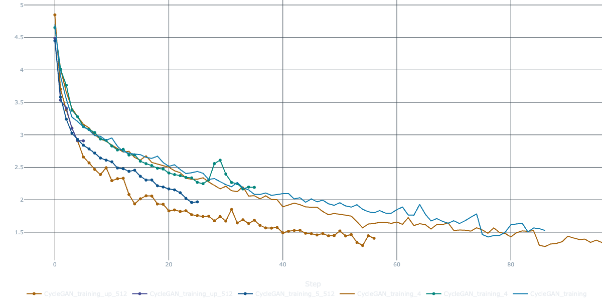
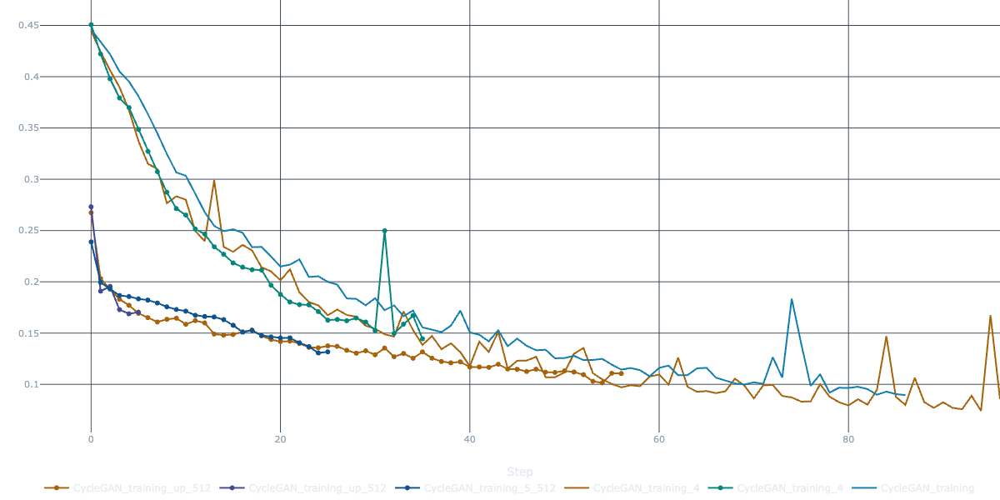
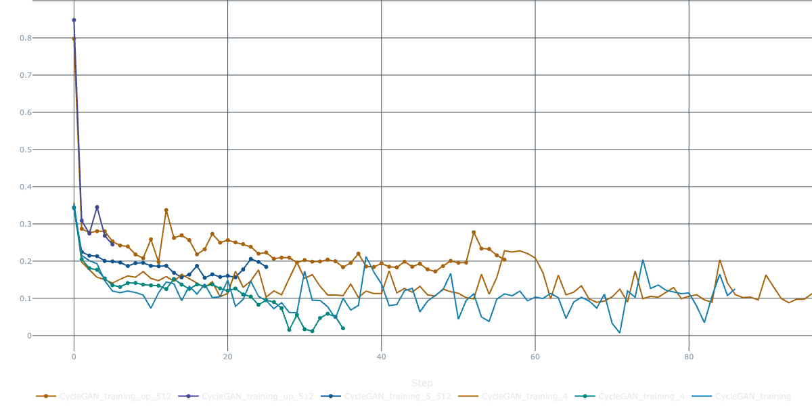
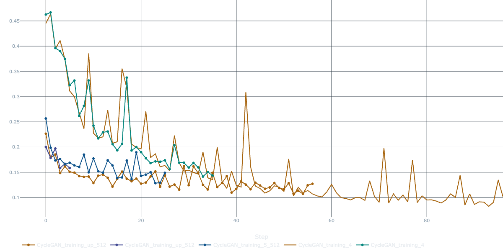
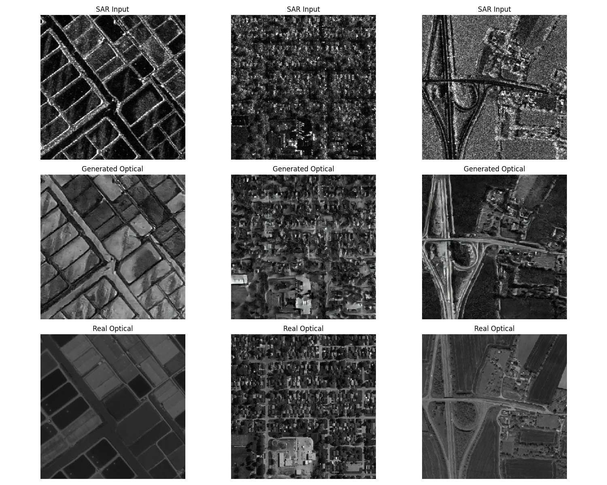

# SAR-to-Optical Image Translation using CycleGAN

This repository contains an implementation of **CycleGAN** for
translating Synthetic Aperture Radar (SAR) images into optical
(satellite-like) images.\
The project explores how unpaired image-to-image translation can help
visualise SAR data in a more interpretable way.

------------------------------------------------------------------------

## 📌 Features

-   CycleGAN implementation with PyTorch.
-   Training and experiment tracking using **MLflow** (integrated with
    **DAGsHub**).
-   Metrics logging (Cycle Consistency Loss, Identity Loss,
    Discriminator Loss).
-   Example SAR → Optical translation results.
-   Support for custom SAR/Optical datasets.

------------------------------------------------------------------------

## 📂 Repository Structure

    ├── MLFlow_CycleGAN.ipynb    # Training notebook with MLflow integration
    ├── results/                 # Output images and evaluation plots
    │   ├── cycle_loss.png
    │   ├── identity_loss.png
    │   ├── train_d_loss.png
    │   ├── val_identity_losses.png
    │   ├── Results.png
    │   └── train_g_loss.png
    └── README.md                # Project documentation

------------------------------------------------------------------------

## 🚀 Getting Started

### 1. Clone the repo

``` bash
git clone https://github.com/0xKushwaha/SAR-to-Optical-CycleGAN.git
cd SAR-to-Optical-CycleGAN
```

### 2. Install dependencies

Make sure you have **Python 3.8+**, PyTorch, and MLflow installed along
with standard libraries like matplotlib, numpy, and pillow.

### 3. Dataset Used

- [SAR2OPT dataset](https://github.com/MarsZhaoYT/SAR2Opt-Heterogeneous-Dataset).

Update dataset paths in the notebook (`MLFlow_CycleGAN.ipynb`) before
training.

### 4. Training

``` bash
jupyter notebook MLFlow_CycleGAN.ipynb
```

All metrics will be tracked automatically with **MLflow**, logged to
**DAGsHub**.

------------------------------------------------------------------------

## 📟 MLflow + DAGsHub Integration

This project uses **DAGsHub** as the MLflow tracking server.
To view experiments:

1.  Log in to [DAGsHub](https://dagshub.com).
2.  Navigate to your project → **Experiments** tab.
3.  Runs, metrics, and artefacts are synced automatically.

If you want to run MLflow locally as well, use:

``` bash
mlflow ui --host 0.0.0.0 --port 5000
```

Then open <http://localhost:5000> in your browser.

------------------------------------------------------------------------

## 📊 Training Metrics

### Cycle Consistency Loss



### Identity Loss



### Discriminator Loss



### Validation Identity Loss



------------------------------------------------------------------------

## 🖼 Example Results

Below are some sample outputs after training (SAR → Generated Optical vs
Real Optical):



------------------------------------------------------------------------

## 📈 Observations

-   Loss functions show stable convergence over training.
-   Generated optical images preserve spatial structures from SAR
    inputs.
-   Model performance improves with higher resolution inputs (512x512).

------------------------------------------------------------------------

## 📜 License

This project is licensed under the MIT License.
